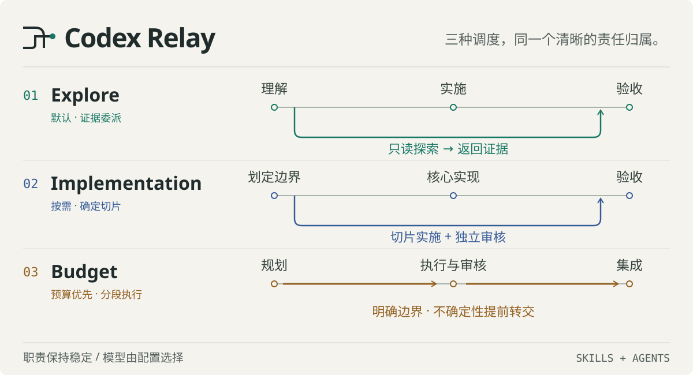

<p align="right">
  <strong>简体中文</strong> · <a href="./readme/README.en.md">English</a>
</p>

<p align="center">
  
</p>

<p align="center">
  <strong>三种调度哲学，一套清晰边界。</strong><br>
  为 Codex 项目任务选择成本优先、只外包探索，或由父级 Sol 控制 Explore / Execute / Review 全车道。
</p>

<p align="center">
  <a href="#选择适合你的-relay">选择 Relay</a> ·
  <a href="#快速验证">快速验证</a> ·
  <a href="#共同原则">共同原则</a> ·
  <a href="#仓库结构">仓库结构</a>
</p>

## 选择适合你的 Relay

`codex-relay` 收录了三套可独立安装的 Codex 多 Agent 调度包。它们都由 Skill 与 custom Agent profile 组成，不引入新的 Runner 或常驻服务；真正的区别是你希望把哪些工作送出父会话，以及最想守住什么。

| Relay | 首要目标 | 可委派范围 | 适合场景 |
| --- | --- | --- | --- |
| [Poor Relay](./poor-relay/README.md) | 让 Luna 承担大多数工作，只在风险或价值足够高时升级 | 规划、探索、执行、审核与集成按成本分层 | 日常项目、预算敏感、希望减少高成本推理 |
| [Sol Explore Relay](./sol-explore-relay/README.md) | 节约检索上下文，同时让父级 Sol 亲自实现 | **仅 4 个只读 Explore profile** | 质量敏感、共享文件多、希望避免实现交接 |
| [Sol-led Relay](./sol-led-relay/README.md) | 让父级 Sol 保留决策、集成与交付权 | Explore ×4、Execute ×3、Review ×2 | 复杂项目、适合有界切片与独立审核 |

### Poor Relay — 成本优先

Luna 负责高上下文调查、常规实现和自检；Terra 只在自动化证据覆盖不了关键风险时审核，Sol 保留多步骤规划、失败升级与最终技术集成。

**完整指南：[poor-relay/README.md](./poor-relay/README.md)**

### Sol Explore Relay — 只外包探索

四个只读 Explorer 分别追踪仓库、核对官方资料、分析单一运行问题或对齐跨系统矛盾证据。父级 Sol 复核关键切片后，自行规划、编辑、测试、审核真实 diff 并交付；没有任何写入或审核子角色。

**完整指南：[sol-explore-relay/README.md](./sol-explore-relay/README.md)**

### Sol-led Relay — 全车道控制

父级 Sol 负责需求、架构、共享文件协调、结果接纳与最终交付，同时把来源、范围、检查和停止条件明确的任务切片送入 Explorer、Executor 与 Reviewer 专用回路。

**完整指南：[sol-led-relay/README.md](./sol-led-relay/README.md)**

## 快速验证

先验证准备使用的源码包，再按对应 README 安装。三套 Skill 都支持隐式调用；同一个任务域应只选择一套主导策略，避免重叠规则同时抢占路由。

<details>
<summary><strong>验证 Poor Relay</strong></summary>

```powershell
Push-Location .\poor-relay
.\scripts\verify.ps1
Pop-Location
```

</details>

<details>
<summary><strong>验证 Sol Explore Relay</strong></summary>

```powershell
Push-Location .\sol-explore-relay
python -X utf8 skills\sol-explore-relay\scripts\validate_sol_explore_relay.py
Pop-Location
```

</details>

<details>
<summary><strong>验证 Sol-led Relay</strong></summary>

```powershell
Push-Location .\sol-led-relay
python -X utf8 skills\sol-led-relay\scripts\validate_sol_led_relay.py
Pop-Location
```

</details>

> 静态验证只能证明包内配置与契约自洽。安装后仍应开启一个新的 Codex task，确认实际发现的 Agent、模型、reasoning effort、有效 sandbox / approval policy 与可见工具；声明为只读的角色需要在目标项目内用可丢弃 fixture 验证实际隔离。

## 共同原则

- **委派必须有收益**：简单、明确的一步任务留在父会话中直接完成。
- **只启用所选边界**：成本分层、Explore-only 与全车道分流是三种不同策略，不应在同一任务域叠加解释。
- **返回证据，不转移权力**：子 Agent 提供文件、行号、来源、检查结果和风险；父级决定是否接受。
- **写入必须有明确所有者**：Sol Explore Relay 的写入只属于父级；其他 Relay 也必须为每个写入切片指定所有者。
- **失败不会自动扩权**：超时、静默、证据不足或检查失败都不自动授权重试、升级或接管。
- **仓库治理始终优先**：Relay 不覆盖用户权限、项目规则、Git 流程或显式验收门槛。

## 仓库结构

```text
codex-relay/
├── poor-relay/                     # 成本与风险感知的 5-profile 调度包
│   └── README.md
├── sol-explore-relay/              # Explore-only、父级 Sol 实现的 4-profile 调度包
│   └── README.md
├── sol-led-relay/                  # 父级 Sol 控制三车道的 9-profile 调度包
│   └── README.md
└── readme/
    ├── README.en.md                # 根 README 的英文版本
    └── assets/                     # 根 README 的本地视觉资源
```

从这里进入完整文档：**[Poor Relay](./poor-relay/README.md)** · **[Sol Explore Relay](./sol-explore-relay/README.md)** · **[Sol-led Relay](./sol-led-relay/README.md)**
