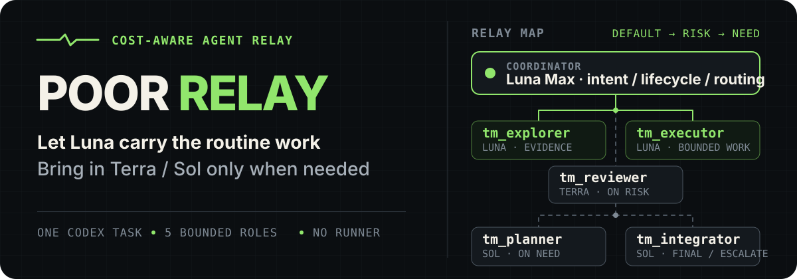

<p align="right">
  <a href="./README.md">简体中文</a> · <strong>English</strong>
</p>

<p align="center">
  
</p>

<p align="center"><strong>One task, end to end. Let Luna carry the bulk of the work, and escalate to Terra or Sol only when the judgment is worth the cost.</strong></p>

<p align="center">
  <a href="#why-poor-relay">Why</a> ·
  <a href="#routing-policy">Routing policy</a> ·
  <a href="#quick-start">Quick start</a> ·
  <a href="#boundaries-and-verification">Boundaries and verification</a>
</p>

## Why Poor Relay

Poor Relay is a cost-aware multi-agent orchestration package for a **single Codex Desk session**. The Coordinator retains user intent, permissions, and task lifecycle; Luna handles context-heavy investigation and routine implementation; and the more expensive independent judgment, architecture planning, and final integration paths are reserved for the points where they add real value.

It is not a new Runner and it launches no external service. The package consists of one implicitly invocable Skill, five custom Agent profiles, two temporary state templates, and a set of local PowerShell scripts.

| Default lane | When it is used | Profiles |
|---|---|---|
| **Luna carries the bulk** | Investigation, search, bounded implementation, and self-checks | `tm_explorer` · `tm_executor` |
| **Terra reviews by risk** | A blocking risk that automated checks cannot fully cover | `tm_reviewer` |
| **Sol joins on demand** | Multi-step planning, failed-task escalation, and final technical integration | `tm_planner` · `tm_integrator` |

> Luna Max is the recommended Coordinator. Poor Relay does not override the current task's effective model, permissions, or repository rules.

## Routing policy

A non-trivial task normally follows the shortest useful path:

1. The Coordinator decides whether delegation is worthwhile; a small, obvious, one-step answer or edit stays in the main task.
2. When investigation would add substantial context noise, `tm_explorer` returns a compressed evidence packet.
3. When architecture, dependencies, or multiple steps require an explicit plan, `tm_planner` writes only a temporary execution plan.
4. Each implementation slice with frozen boundaries goes to `tm_executor`, which also runs its own checks.
5. `tm_reviewer` is triggered only when behavioral risk cannot be fully proven by mechanical verification.
6. If one targeted correction still fails, or cross-task integration is required, the work goes directly to `tm_integrator`.
7. The Coordinator inspects the real diff, evidence, and any still-open acceptance gates before delivering the result.

This flow deliberately caps the number of Agents, writable scope, and retry count. Technology expertise comes from the applicable Skill rather than from continually adding more roles.

## Quick start

Requirements: Windows PowerShell and an available Python 3.11 or newer installation.

From the `poor-relay` directory, verify the source package before installing it:

```powershell
.\scripts\verify.ps1
.\scripts\install.ps1
```

The default installation targets the current Windows user:

```text
%USERPROFILE%\.agents\skills\poor-relay\
%USERPROFILE%\.codex\agents\tm_planner.toml
%USERPROFILE%\.codex\agents\tm_explorer.toml
%USERPROFILE%\.codex\agents\tm_executor.toml
%USERPROFILE%\.codex\agents\tm_reviewer.toml
%USERPROFILE%\.codex\agents\tm_integrator.toml
```

The installer checks every target before writing. If the Skill or any same-named Agent already exists, it stops without overwriting anything. Use the following command only after confirming that this package should replace those existing targets:

```powershell
.\scripts\install.ps1 -Force
```

After installing or updating the profiles, start a new Codex task and inspect the Agents that were actually discovered, including their model, reasoning effort, sandbox, and tools. You can then invoke the Skill explicitly:

```text
Use $poor-relay to complete this multi-step project task.
```

The Skill also allows implicit invocation, but the activation gate still runs first. Small tasks do not start the full workflow merely because Agents are available.

## What's included

```text
poor-relay/
├── agents/                         # 5 explicit custom Agent profiles
├── skills/poor-relay/
│   ├── SKILL.md                    # Routing, retry, escalation, and delivery boundaries
│   ├── agents/openai.yaml          # Codex UI metadata and implicit-invocation policy
│   ├── references/                 # Temporary plan.md / state.md templates
│   └── scripts/validate_poor_relay.py
├── scripts/
│   ├── install.ps1
│   ├── uninstall.ps1
│   └── verify.ps1
├── THIRD_PARTY_NOTICES.md
└── LICENSE
```

All five profiles require an explicit `agent_type`. The package contains no `default.toml`, so it does not replace the user's default Agent.

## Boundaries and verification

- **No delegated authority expansion:** Planner and Integrator may make technical judgments, but they cannot broaden user authorization or substitute for user acceptance.
- **Repository governance wins:** If the user or repository requires OpenSpec, a particular Git workflow, or another governance process, those rules still apply. Poor Relay does not remove or bypass them.
- **Writes have owners:** Executor modifies only the files it explicitly owns; shared files and interface contracts remain immutable.
- **State is temporary:** Multi-step tasks write `plan.md` and `state.md` under `.codex-team/runtime/<task-id>/`. Those files must not be staged or committed.
- **Failures do not create endless handoffs:** One failed targeted correction escalates to Integrator. Terra remains a Reviewer and never becomes the fallback Executor.
- **Static evidence is not runtime proof:** Successful TOML parsing does not prove that a fresh task discovered the configuration or that the requested sandbox is effectively enforced.

Verify the source package:

```powershell
.\scripts\verify.ps1
```

Verify an installed copy:

```powershell
.\scripts\verify.ps1 -Installed
```

The validator checks the Skill frontmatter, UI metadata, References, exact model/reasoning-effort/sandbox values for all five profiles, role safety boundaries, PowerShell syntax, legacy-name residue, and the absence of `default.toml`.

If sandbox isolation is itself an acceptance condition, use a disposable fixture in a fresh Codex task to test a real write rejection. Do not probe production files, credentials, or external systems.

## Uninstall

```powershell
.\scripts\uninstall.ps1
```

The uninstaller removes only the Poor Relay Skill and the five same-named Agent profiles. It preserves the parent `.agents` and `.codex` directories.

## Provenance and license

Poor Relay's text and scripts were independently written. Its workflow design adapts selected ideas from `codex-team-mode`, `wshobson/agents`, `agency-agents`, and `Superpowers`. See [THIRD_PARTY_NOTICES.md](THIRD_PARTY_NOTICES.md) for the specific upstream files, copyright notices, and adaptation boundaries.

The project is licensed under the [MIT License](LICENSE).
