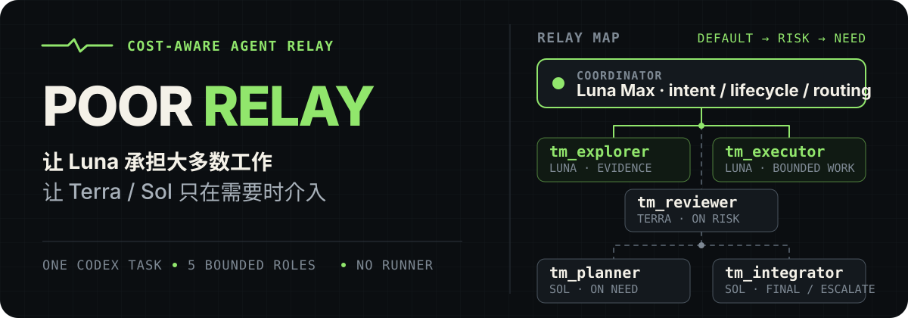

<p align="right">
  <strong>简体中文</strong> · <a href="./README.en.md">English</a>
</p>

<p align="center">
  
</p>

<p align="center"><strong>一次任务完成到底。让 Luna 承担大多数工作，只在判断真正值钱时升级到 Terra 或 Sol。</strong></p>

<p align="center">
  <a href="#为什么是-poor-relay">为什么</a> ·
  <a href="#调度策略">调度策略</a> ·
  <a href="#快速开始">快速开始</a> ·
  <a href="#边界与验证">边界与验证</a>
</p>

## 为什么是 Poor Relay

Poor Relay 是一个面向 **Codex Desk 单会话**的低成本多 Agent 调度包。它让 Coordinator 保留用户意图、权限和任务生命周期，把高上下文调查与常规实现交给 Luna，并把更昂贵的独立判断、架构规划和最终集成限制在确有价值的节点。

它不是新的 Runner，也不启动外部服务。整个包由一个可隐式触发的 Skill、五个 custom Agent profile、两个临时状态模板和一组本地 PowerShell 脚本组成。

| 默认路径 | 何时使用 | 角色 |
|---|---|---|
| **Luna 承担主力** | 调查、搜索、有界实现与自测 | `tm_explorer` · `tm_executor` |
| **Terra 按风险审核** | 自动化检查无法完全覆盖的 blocking risk | `tm_reviewer` |
| **Sol 按需介入** | 多步骤规划、失败升级、最终技术集成 | `tm_planner` · `tm_integrator` |

> 推荐由 Luna Max 担任 Coordinator。Poor Relay 不覆盖当前 task 的有效模型、权限或仓库规则。

## 调度策略

一次复杂任务通常沿着下面的最短路径推进：

1. Coordinator 判断任务是否值得委派；简单的一步回答或修改直接完成。
2. 上下文噪声较大时，由 `tm_explorer` 返回压缩证据包。
3. 任务涉及架构、依赖或多步骤协作时，`tm_planner` 只写临时执行计划。
4. 每个边界明确的实现切片交给 `tm_executor`，并在同一切片内完成自测。
5. 只有行为风险无法被机械验证完全覆盖时，才触发 `tm_reviewer`。
6. 一次定向修复仍失败，或需要跨任务集成时，直接交给 `tm_integrator`。
7. Coordinator 最后核对真实 diff、证据和未关闭的验收门槛，再交付结果。

这个流程刻意限制 Agent 数量、写入范围和重试次数。技术专长通过适用的 Skill 提供，不靠不断增加角色解决。

## 快速开始

要求：Windows PowerShell，以及可用的 Python 3.11 或更高版本。

在 `poor-relay` 目录中先验证源码包，再安装：

```powershell
.\scripts\verify.ps1
.\scripts\install.ps1
```

默认安装到当前 Windows 用户：

```text
%USERPROFILE%\.agents\skills\poor-relay\
%USERPROFILE%\.codex\agents\tm_planner.toml
%USERPROFILE%\.codex\agents\tm_explorer.toml
%USERPROFILE%\.codex\agents\tm_executor.toml
%USERPROFILE%\.codex\agents\tm_reviewer.toml
%USERPROFILE%\.codex\agents\tm_integrator.toml
```

安装器会先检查所有目标；只要 Skill 或任一同名 Agent 已存在，默认就停止且不覆盖。确认现有目标确实应由本包替换时，才显式执行：

```powershell
.\scripts\install.ps1 -Force
```

安装或更新后，请启动一个新的 Codex task，并检查实际发现到的 Agent 名称、模型、reasoning effort、sandbox 与工具。然后可以显式调用：

```text
Use $poor-relay to complete this multi-step project task.
```

Skill 也允许隐式触发，但仍会先经过 activation gate；小任务不会为了使用 Agent 而启动完整流程。

## 包含内容

```text
poor-relay/
├── agents/                         # 5 个显式 custom Agent profile
├── skills/poor-relay/
│   ├── SKILL.md                    # 调度、重试、升级与交付边界
│   ├── agents/openai.yaml          # Codex UI 元数据与隐式触发策略
│   ├── references/                 # 临时 plan.md / state.md 模板
│   └── scripts/validate_poor_relay.py
├── scripts/
│   ├── install.ps1
│   ├── uninstall.ps1
│   └── verify.ps1
├── THIRD_PARTY_NOTICES.md
└── LICENSE
```

五个 profile 都要求显式 `agent_type`；包中没有 `default.toml`，因此不会替换用户级默认 Agent。

## 边界与验证

- **权限不扩张**：Planner 和 Integrator 可以做技术判断，但不能扩大用户授权或代替用户验收。
- **仓库治理优先**：若用户或仓库要求 OpenSpec、特定 Git 流程或其他规则，继续服从；Poor Relay 不删除或绕过这些文件。
- **写入有归属**：Executor 只修改明确拥有的文件，共享文件与接口契约保持不可变。
- **状态是临时的**：多步骤任务把 `plan.md` 和 `state.md` 写入 `.codex-team/runtime/<task-id>/`；这些文件不应 stage 或 commit。
- **失败不会无限接力**：一次定向修复仍失败就升级到 Integrator；Terra 始终是 Reviewer，不变成执行者。
- **静态证据不是运行时证明**：TOML 解析成功不能证明新 task 已发现配置，也不能证明 sandbox 的实际隔离效果。

验证源码包：

```powershell
.\scripts\verify.ps1
```

验证已安装副本：

```powershell
.\scripts\verify.ps1 -Installed
```

验证器会检查 Skill frontmatter、UI 元数据、Reference、五个 profile 的精确模型/推理强度/sandbox、角色安全边界、PowerShell 语法、命名残留以及 `default.toml` 缺失。

若 sandbox 隔离本身是验收条件，请在新的 Codex task 中使用一次性 fixture 做真实写入拒绝测试，不要对生产文件、凭据或外部系统做权限探测。

## 卸载

```powershell
.\scripts\uninstall.ps1
```

卸载脚本只移除 Poor Relay Skill 和五个同名 Agent profile，并保留父级 `.agents` 与 `.codex` 目录。

## 来源与许可证

Poor Relay 的文本和脚本为重新编写，工作流设计吸收了 `codex-team-mode`、`wshobson/agents`、`agency-agents` 与 `Superpowers` 的部分思想。具体来源文件、版权与改编边界见 [THIRD_PARTY_NOTICES.md](THIRD_PARTY_NOTICES.md)。

项目采用 [MIT License](LICENSE)。
