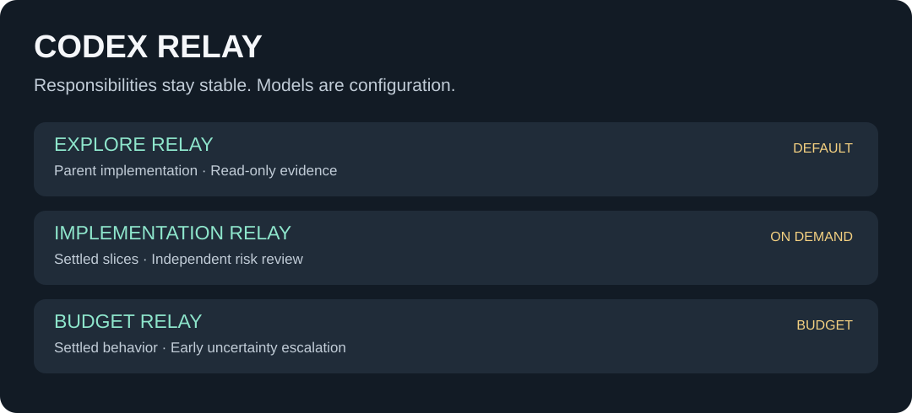

<p align="right">
  <a href="../README.md">简体中文</a> · <strong>English</strong>
</p>

<p align="center">
  
</p>

<p align="center">
  <strong>Four routing philosophies. One clear set of boundaries.</strong><br>
  Choose cost-first delegation, outsource only exploration, relay planning into execution across two fresh Sol contexts, or let parent Sol control complete lanes.
</p>

<p align="center">
  <a href="#choose-your-relay">Choose a Relay</a> ·
  <a href="#quick-verification">Quick verification</a> ·
  <a href="#shared-principles">Shared principles</a> ·
  <a href="#repository-map">Repository map</a>
</p>

## Choose your Relay

`codex-relay` contains four independently installable Codex multi-agent routing packages. Each combines a Skill with custom Agent profiles and adds no new Runner or resident service. The real choice is which work may leave the parent session and what you most need to protect.

| Relay | Primary goal | Delegation surface | Best fit |
| --- | --- | --- | --- |
| [Poor Relay](../poor-relay/README.en.md) | Let Luna carry most work and escalate only when risk or value justifies it | Cost-tiered planning, exploration, execution, review, and integration | Everyday work, budget sensitivity, less high-cost reasoning |
| [Sol Explore Relay](../sol-explore-relay/README.en.md) | Save search context while parent Sol implements the task itself | **Only 4 read-only Explore profiles** | Quality-sensitive work, shared files, avoiding implementation handoffs |
| [Sol Pair Relay](../sol-pair-relay/README.en.md) | Give separate Sol agents clean planning and execution contexts | Luna Max explores, one Sol Max plans, a second Sol Max executes and accepts | Luna / Terra parent conversations, implementation quality, temporary plans that prevent drift |
| [Sol-led Relay](../sol-led-relay/README.en.md) | Keep decision, integration, and delivery authority with parent Sol | Explore ×4, Execute ×3, Review ×2 | Complex projects with bounded slices and independent review |

### Poor Relay — cost first

Luna handles context-heavy investigation, routine implementation, and self-checks. Terra reviews only when automated evidence cannot cover a blocking risk, while Sol keeps multi-step planning, failed-task escalation, and final technical integration.

**Complete guide: [poor-relay/README.en.md](../poor-relay/README.en.md)**

### Sol Explore Relay — outsource only exploration

Four read-only Explorers trace the repository, verify official sources, investigate one runtime question, or reconcile contradictory cross-system evidence. Parent Sol rechecks critical slices, then plans, edits, tests, reviews the real diff, and delivers. There are no delegated writers or reviewers.

**Complete guide: [sol-explore-relay/README.en.md](../sol-explore-relay/README.en.md)**

### Sol Pair Relay — two fresh Sol contexts

Luna or Terra keeps the parent conversation while Luna Max compresses optional exploration evidence. One fresh Sol Max writes only a temporary `plan.md`; a different fresh Sol Max follows it, runs checks, inspects the real diff, and performs technical acceptance. The two Sol agents share no long transcript—only the approved plan and minimal decision-critical evidence.

**Complete guide: [sol-pair-relay/README.en.md](../sol-pair-relay/README.en.md)**

### Sol-led Relay — controlled lanes

Parent Sol owns requirements, architecture, shared-file coordination, result acceptance, and final delivery while bounded packets with explicit sources, scope, checks, and stop conditions move through Explorer, Executor, and Reviewer lanes.

**Complete guide: [sol-led-relay/README.en.md](../sol-led-relay/README.en.md)**

## Quick verification

Verify the source package you intend to use, then follow its README to install it. All four Skills support implicit invocation, so choose one governing strategy per task domain rather than letting overlapping rules compete for the same route.

<details>
<summary><strong>Verify Poor Relay</strong></summary>

```powershell
Push-Location .\poor-relay
.\scripts\verify.ps1
Pop-Location
```

</details>

<details>
<summary><strong>Verify Sol Explore Relay</strong></summary>

```powershell
Push-Location .\sol-explore-relay
python -X utf8 skills\sol-explore-relay\scripts\validate_sol_explore_relay.py
Pop-Location
```

</details>

<details>
<summary><strong>Verify Sol Pair Relay</strong></summary>

```powershell
Push-Location .\sol-pair-relay
.\scripts\verify.ps1
Pop-Location
```

</details>

<details>
<summary><strong>Verify Sol-led Relay</strong></summary>

```powershell
Push-Location .\sol-led-relay
python -X utf8 skills\sol-led-relay\scripts\validate_sol_led_relay.py
Pop-Location
```

</details>

> Static validation proves only package consistency. After installation, start a new Codex task and inspect the Agents actually discovered, including model, reasoning effort, effective sandbox and approval policy, and visible tools. Verify claimed read-only isolation with a disposable fixture inside the target project.

## Shared principles

- **Delegation must earn its cost:** small, obvious, one-step tasks stay in the parent session.
- **Activate only the chosen boundary:** cost tiers, Explore-only routing, the two-Sol relay, and full-lane routing are distinct strategies and should not govern the same task domain together.
- **Return evidence, not authority:** children provide files, lines, sources, checks, and risks; the parent decides whether to accept them.
- **Every write has an explicit owner:** Sol Explore Relay reserves writes for the parent; other Relays still name an owner for every writable slice.
- **Context isolation must be real:** Sol Pair Relay requires different Planner and Executor Agents, with temporary `plan.md` as their only durable handoff.
- **Failure does not expand authority:** timeout, silence, insufficient evidence, or a failed check never grants an automatic retry, escalation, or takeover.
- **Repository governance still wins:** a Relay does not override user permissions, project rules, Git workflow, or explicit acceptance gates.

## Repository map

```text
codex-relay/
├── poor-relay/                     # Cost- and risk-aware 5-profile routing package
│   └── README.en.md
├── sol-explore-relay/              # Explore-only, parent-implemented 4-profile package
│   └── README.en.md
├── sol-pair-relay/                 # Luna / Terra parent, two-Sol relay, 3-profile package
│   └── README.en.md
├── sol-led-relay/                  # Parent-Sol-controlled 9-profile, three-lane package
│   └── README.en.md
└── readme/
    ├── README.en.md                # This English repository overview
    └── assets/                     # Local visuals for the repository overview
```

Continue with the complete guides: **[Poor Relay](../poor-relay/README.en.md)** · **[Sol Explore Relay](../sol-explore-relay/README.en.md)** · **[Sol Pair Relay](../sol-pair-relay/README.en.md)** · **[Sol-led Relay](../sol-led-relay/README.en.md)**
