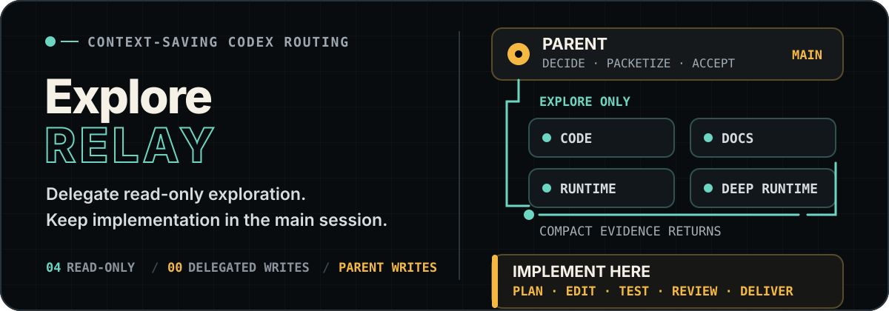
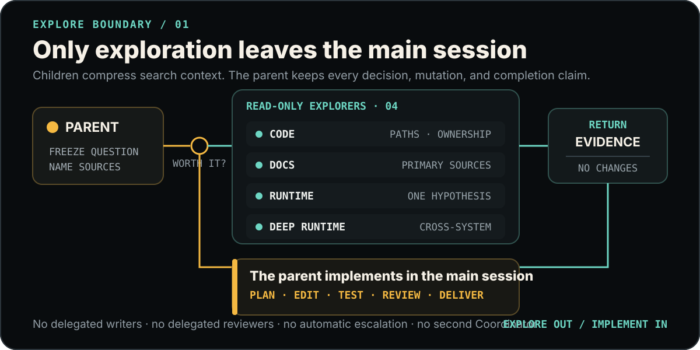

> Default mode: the parent owns critical understanding, implementation, and acceptance. Use a short handoff with relevant constraints and any real budget; results identify coverage and source freshness. Sufficient evidence, obsolete work, or exhausted budget can end a delegation with a recorded reason and confirmed stop before resource reuse.

<p align="right">
  <a href="./README.md">简体中文</a> · <strong>English</strong>
</p>

<p align="center">
  
</p>

<p align="center">
  <strong>Send out the search context. Keep implementation quality in the main session.</strong><br>
  The parent delegates only bounded read-only exploration, then plans, edits, reviews, verifies, and delivers the work itself.
</p>

<p align="center">
  <a href="#what-it-solves">Core boundary</a> ·
  <a href="#routing-board">Routing board</a> ·
  <a href="#install-into-a-project">Install</a> ·
  <a href="#verification">Verify</a>
</p>

## What it solves

Complex implementation often begins with a large amount of code, official documentation, or runtime evidence. Keeping all of it in the parent session crowds out the context needed for design, editing, and verification. Delegating implementation as well introduces interface drift, shared-file conflicts, and a second acceptance burden.

`explore-relay` removes only the first cost:

- all 4 profiles are read-only Explorers;
- there are 0 Executors, Fixers, Reviewers, Integrators, or `default` catch-alls;
- children return compressed evidence maps, and the parent rechecks only decision-critical slices;
- every mutation, implementation choice, check interpretation, and completion claim remains parent-owned.

> This relay recommends an Astra parent and preserves the active model. It does not create another Coordinator or hand the user conversation to a child.

## Routing board

<p align="center">
  
</p>

| Evidence question | Agent | Model | Stop boundary |
| --- | --- | --- | --- |
| Repository ownership, symbols, call paths, dependencies, data flow, or blast radius | `explore_code` | Luna Max | Cited file and line evidence is sufficient, or scope must expand |
| Current official docs, APIs, version behavior, standards, or upstream facts | `explore_docs` | Luna Max | Primary sources answer the question, or materially conflict |
| One log, trace, test failure, process state, or runtime hypothesis | `explore_runtime` | Luna Max | Follow useful evidence until a conclusion or an evidence/budget boundary |
| A named cross-system question or materially contradictory evidence | `explore_runtime_deep` | Terra Max | Named systems reconcile, or a precise missing-evidence boundary is reached |

The parent may route a new deep question when an earlier investigation discovers cross-system or conflicting evidence. An inconclusive result alone does not justify rerunning the same question on another model.

## One complete flow

1. The parent decides whether isolated exploration saves more context than dispatch costs.
2. The parent supplies the question, useful sources, read boundary, and completion evidence; optional packet labels are not required.
3. One or more Explorers investigate in isolated context, with independent questions in parallel within host capacity and user budgets.
4. Each Explorer returns a direct answer, exact evidence, conflicts, unknowns, and the smallest next step; it changes no files.
5. The parent rechecks decision-critical evidence, then plans, edits, runs completion checks, inspects the real diff, and delivers.

Small, obvious one-step lookups stay direct. Dispatch is not a mandatory pipeline and cannot become a reason to postpone implementation.

## Install into a project

There are only two installation surfaces:

```text
<target-project>/
├── .codex/agents/explore_*.toml
└── .codex/skills/explore-relay/**
```

The four Agents use a unique `explore_*` prefix so they remain distinct from other Relay profiles. This PowerShell example stops on a same-name source instead of silently overwriting it:

```powershell
$relaySource = "D:\path\to\codex-relay\relay\explore-relay"
$targetProject = "D:\path\to\target-project"
$agentTarget = Join-Path $targetProject ".codex\agents"
$skillTarget = Join-Path $targetProject ".codex\skills\explore-relay"

$profileNames = Get-ChildItem (Join-Path $relaySource "agents\*.toml") |
    Select-Object -ExpandProperty Name
$conflicts = $profileNames |
    Where-Object { Test-Path (Join-Path $agentTarget $_) }
if ($conflicts -or (Test-Path $skillTarget)) {
    throw "A same-name Agent or Skill already exists; confirm its source first: $($conflicts -join ', ')"
}

New-Item -ItemType Directory -Force $agentTarget, $skillTarget | Out-Null
Copy-Item (Join-Path $relaySource "agents\*.toml") $agentTarget
Copy-Item (Join-Path $relaySource "skills\explore-relay\*") $skillTarget -Recurse
```

If the target project already has a Skill installer or Junction convention, wire `skills/explore-relay` into that flow as the single canonical source.

## Verification

Run from this package root:

```powershell
python -X utf8 skills\explore-relay\scripts\validate_explore_relay.py
```

The validator checks exactly 4 profiles, unique names, models, `max` reasoning effort, `read-only` sandbox defaults, implicit Skill invocation, route references, and local links. Instruction-following behavior is evaluated separately.

Parsing configuration does not prove runtime discovery. After installation, start a new Codex task and inspect the Agents actually discovered, including model, reasoning effort, effective sandbox and approval policy, and visible tools. If read-only isolation is an acceptance requirement, use only a disposable fixture inside the target project for mutation probes. Record any successful Explorer write as `NOT_ENFORCED`.

## Package map

```text
explore-relay/
├── agents/                              # 4 uniquely named read-only Explorers
│   ├── explore_code.toml
│   ├── explore_docs.toml
│   ├── explore_runtime.toml
│   └── explore_runtime_deep.toml
├── skills/explore-relay/
│   ├── SKILL.md                         # Activation, routing, concurrency, parent boundary
│   ├── agents/openai.yaml               # UI metadata and implicit invocation
│   ├── references/                      # Dispatch, routing, and evaluation contracts
│   └── scripts/                         # Static validator
├── assets/readme/                       # Bilingual editable pure SVG
├── README.en.md
└── README.md
```

## Design boundary

| Explorers may | Only the parent may |
| --- | --- |
| Trace repository facts within named read sources | Decide requirements, architecture, interfaces, permissions, and scope |
| Verify current primary documentation and version facts | Choose an implementation and modify any file |
| Analyze existing logs, traces, and runtime evidence | Run or interpret completion checks, review the diff, and accept risk |
| Return precise citations, conflicts, and unknowns | Mutate Git, create build artifacts, publish, write externally, communicate with the user, and deliver |

The complete behavior is in [`SKILL.md`](./skills/explore-relay/SKILL.md), with detailed contracts in [`contracts.md`](./skills/explore-relay/references/contracts.md), [`routing.md`](./skills/explore-relay/references/routing.md), and [`evaluation.md`](./skills/explore-relay/references/evaluation.md).

Existing installations: use the repository Relay Installer for migration preflight, backup, and switching. Manual copy and package install scripts are for clean targets only.
