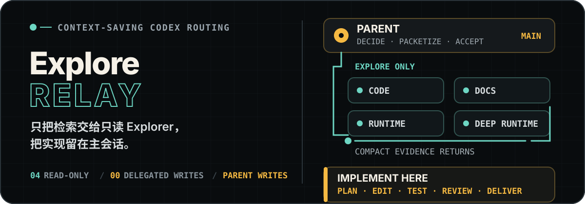
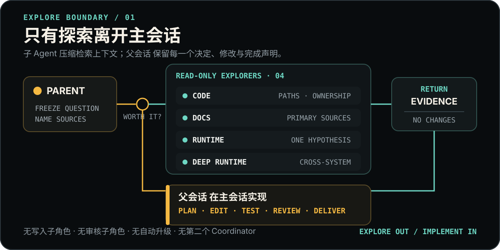

> 默认模式：父会话持续负责关键理解、实施和验收。使用简短交接说明相关约束和实际存在的预算；返回说明覆盖范围与来源版本。父会话可记录理由结束预算耗尽、证据足够或已失效的调查，确认停止后再接管资源。

<p align="right">
  <strong>简体中文</strong> · <a href="./README.en.md">English</a>
</p>

<p align="center">
  
</p>

<p align="center">
  <strong>把检索上下文送出去，把实现质量留在主会话。</strong><br>
  父会话 只委派有边界的只读 Explore；规划、编辑、审核、验证与交付全部亲自完成。
</p>

<p align="center">
  <a href="#它解决什么">核心边界</a> ·
  <a href="#路由面板">路由面板</a> ·
  <a href="#安装到项目">安装</a> ·
  <a href="#验证">验证</a>
</p>

## 它解决什么

复杂实现往往需要先读大量代码、官方文档或运行日志。全部留在父会话里，会挤占后续设计、修改和验证所需的上下文；把实现也交出去，又会增加接口漂移、共享文件冲突和二次验收成本。

`explore-relay` 只切走前一种成本：

- 4 个 profile 全部是只读 Explorer；
- 0 个 Executor、Fixer、Reviewer、Integrator 或 `default` catch-all；
- 子 Agent 返回压缩后的证据地图，父会话 只复核决策关键切片；
- 每一处修改、实现选择、检查解释与完成声明仍由父会话 负责。

> 推荐主会话使用 Astra，并保留当前模型设置。它不会创建另一个 Coordinator，也不会把用户对话转交给子 Agent。

## 路由面板

<p align="center">
  
</p>

| 证据问题 | Agent | 模型 | 停止边界 |
| --- | --- | --- | --- |
| 仓库归属、符号、调用路径、依赖、数据流、影响面 | `explore_code` | Luna Max | 得到带文件与行号的证据，或范围需要扩大 |
| 当前官方文档、API、版本行为、标准、上游事实 | `explore_docs` | Luna Max | 一手来源足以回答，或来源发生实质冲突 |
| 单一日志、trace、测试失败、进程状态或运行假设 | `explore_runtime` | Luna Max | 沿有效证据调查，直至得出结论或触及证据／预算边界 |
| 明确的跨系统问题，或现有证据实质矛盾 | `explore_runtime_deep` | Terra Max | 命名系统被对齐，或触及明确的缺失证据边界 |

先前调查发现跨系统或冲突证据时，父会话可据此提出新的 Deep Runtime 问题。单纯无结论不能成为换模型重跑的理由。

## 一次完整工作流

1. 父会话 判断独立探索节省的上下文是否高于派发成本。
2. 父级说明问题、必要来源、只读范围和完成证据，无需填写固定字段表。
3. 一个或多个 Explorer 在隔离上下文中调查，在宿主容量和用户预算内并行互不依赖的问题。
4. Explorer 返回直接答案、精确证据、冲突、未知项与最小下一步；不产生文件修改。
5. 父级只复核决策关键证据，自行规划、编辑、运行完成检查、审阅真实 diff 并交付。

小而明确的一步查询直接留在父会话。派发不是固定流水线，也不能成为推迟实现的理由。

## 安装到项目

标准安装面只有两处：

```text
<target-project>/
├── .codex/agents/explore_*.toml
└── .codex/skills/explore-relay/**
```

四个 Agent 使用 `explore_*` 唯一前缀，可与其他 Relay profile 区分。下面的 PowerShell 示例发现同名来源时会停止，不会静默覆盖：

```powershell
$relaySource = "D:\path\to\codex-relay\relay\explore-relay"
$targetProject = "D:\path\to\target-project"
$agentTarget = Join-Path $targetProject ".codex\agents"
$skillTarget = Join-Path $targetProject ".codex\skills\explore-relay"

$profileNames = Get-ChildItem (Join-Path $relaySource "agents\*.toml") |
    Select-Object -ExpandProperty Name
$conflicts = $profileNames |
    Where-Object { Test-Path (Join-Path $agentTarget $_) }
if ($conflicts -or (Test-Path $skillTarget)) {
    throw "发现同名 Agent 或 Skill；请先确认来源：$($conflicts -join ', ')"
}

New-Item -ItemType Directory -Force $agentTarget, $skillTarget | Out-Null
Copy-Item (Join-Path $relaySource "agents\*.toml") $agentTarget
Copy-Item (Join-Path $relaySource "skills\explore-relay\*") $skillTarget -Recurse
```

如果目标项目已有 Skill 安装器或 Junction 约定，请把 `skills/explore-relay` 作为唯一源目录接入现有流程。

## 验证

在本包根目录运行：

```powershell
python -X utf8 skills\explore-relay\scripts\validate_explore_relay.py
```

验证器会检查 4 个且仅 4 个 profile、唯一名称、模型、`max` 推理强度、`read-only` sandbox 默认值、隐式 Skill 调用、路由引用和本地链接。提示词的实际遵循行为另行评估。

配置解析通过不等于运行时已经生效。安装后应开启一个新的 Codex task，确认实际发现的 Agent、模型、reasoning effort、有效 sandbox / approval policy 与可见工具。需要证明只读隔离时，只能在目标项目内的可丢弃 fixture 上做写入探针；任何 Explorer 能够写入时都应记录为 `NOT_ENFORCED`。

## 包结构

```text
explore-relay/
├── agents/                              # 4 个唯一命名的只读 Explorer
│   ├── explore_code.toml
│   ├── explore_docs.toml
│   ├── explore_runtime.toml
│   └── explore_runtime_deep.toml
├── skills/explore-relay/
│   ├── SKILL.md                         # 激活、路由、并发与父级边界
│   ├── agents/openai.yaml               # 展示信息与隐式调用策略
│   ├── references/                      # dispatch、路由与评估契约
│   └── scripts/                         # 静态验证器
├── assets/readme/                       # 双语、可编辑的纯 SVG
├── README.en.md
└── README.md
```

## 设计边界

| Explorer 可以做 | 只能由父会话 做 |
| --- | --- |
| 在明确来源和只读范围内追踪仓库事实 | 决定需求、架构、接口、权限与范围 |
| 核对当前一手文档与版本事实 | 选择实现并修改任何文件 |
| 分析现有日志、trace 与运行证据 | 执行或解释完成检查、审阅 diff 与接受风险 |
| 返回精确引用、冲突与未知项 | Git、构建产物、发布、外部写入、用户沟通与最终交付 |

完整规则见 [`SKILL.md`](./skills/explore-relay/SKILL.md)；细分契约见 [`contracts.md`](./skills/explore-relay/references/contracts.md)、[`routing.md`](./skills/explore-relay/references/routing.md) 与 [`evaluation.md`](./skills/explore-relay/references/evaluation.md)。

已有安装请使用仓库 Relay Installer 完成迁移预检、备份与切换。手动复制和包内安装脚本仅用于干净目标。
