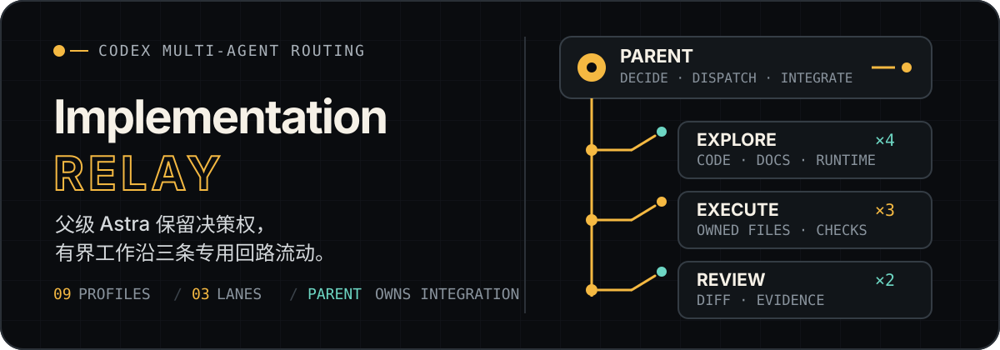
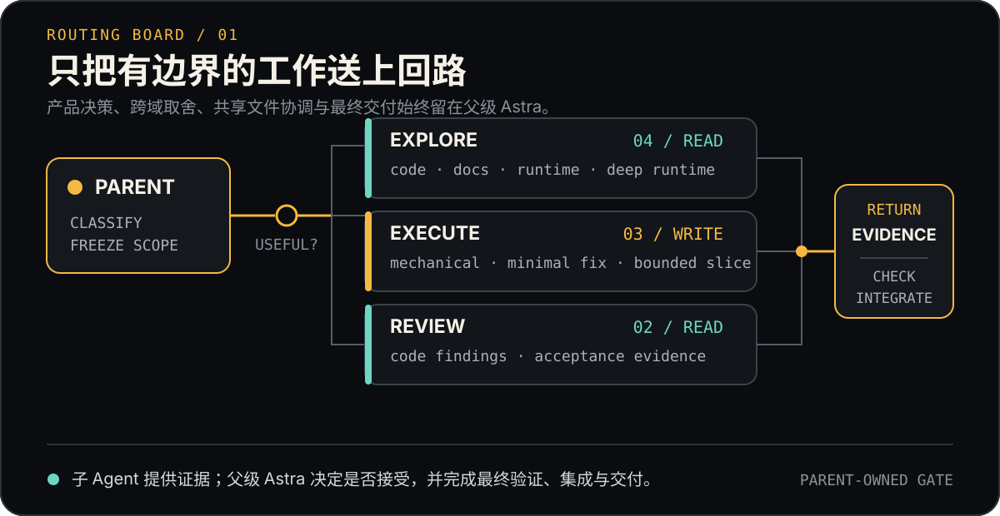

> 扩展模式：父会话（推荐 Astra）持续负责核心实现。仅委派行为确定、可独立检查且剩余判断少的切片；需要持续状态、持久化、并发、安全或核心交互判断的工作留在父会话。审核结论只覆盖指定风险。简短交接说明相关约束和实际存在的预算，报告说明覆盖范围与来源版本；取消需记录理由，复用资源或移交写入权前确认停止。

<p align="right">
  <strong>简体中文</strong> · <a href="./README.en.md">English</a>
</p>

<p align="center">
  
</p>

<p align="center">
  <strong>让 Astra 保留决策权，让复杂任务沿边界清晰的回路流动。</strong><br>
  面向项目级 Codex 工作的窄职责多 Agent 调度包：按需探索、有限执行、独立复核，最终仍由父会话集成与交付。
</p>

## 它解决什么

复杂任务需要分工，但分工不该稀释责任。Implementation Relay 将可隔离的工作交给 9 个专用 profile，同时把需求澄清、架构决策、共享文件协调、最终验证和对外交付留在父级 Astra。

- **按收益委派**：只有上下文隔离、并行调查或独立复核确有价值时才启动子 Agent；小而明确的任务直接完成。
- **按边界路由**：Explorer 只取证，Executor 只写已冻结的范围，Reviewer 只审查真实 diff 或验收证据。
- **按契约交接**：说明目标、必要来源、所有权和验收证据，无需填写固定字段表。
- **依据证据恢复**：超时和暂时没有 diff 不等于失败；新证据支持进展时继续范围内修正，移交所有权前确认原工作者停止。

## 路由面板

<p align="center">
  
</p>

| 回路 | 适合处理 | Profiles | 默认权限 |
| --- | --- | --- | --- |
| **Explore ×4** | 代码路径、外部文档、单点运行证据、跨系统或证据矛盾的问题 | `code_explorer` · `docs_researcher` · `runtime_investigator` · `runtime_investigator_deep` | read-only |
| **Execute ×3** | 精确机械修改、已确认根因的最小修复、接口与验收条件已冻结的功能切片 | `mechanical_executor` · `minimal_fixer` · `bounded_executor` | workspace-write |
| **Review ×2** | 真实实现的正确性/回归审查、逐项验收证据核对 | `code_reviewer` · `verification_reviewer` | read-only |

所有 profile 均使用 `model_reasoning_effort = "max"`。`runtime_investigator_deep`、`code_reviewer` 与 `verification_reviewer` 使用 `gpt-5.6-terra`；其余 profile 使用 `gpt-5.6-luna`。

> `runtime_investigator_deep` 需要明确的跨系统问题或冲突证据，也可来自先前调查的新发现；单纯无结论不能触发自动升级。

## 一次完整接力

1. **父级判断是否值得委派**：未解决的产品、架构、安全、权限和跨系统决策不下放。
2. **选择最小角色集合**：在宿主容量内并行独立工作；并行写者须拥有不相交的文件、稳定接口及独立的生成产物和运行资源。
3. **发送有界 packet**：说明目标、来源、范围和验收证据；子 Agent 不得继续派生后代。
4. **接收证据而非结论权**：父级检查实际文件、diff、产物和验证输出，再决定是否接受。
5. **由父级完成闭环**：集成、Git 操作、构建、发布、外部写入和最终回复始终属于父会话。

## 安装到项目

标准安装面只有两处：

```text
<target-project>/
├── .codex/agents/*.toml
└── .codex/skills/implementation-relay/**
```

下面的 PowerShell 示例会在发现同名 Agent 或 Skill 时停止，不覆盖来源不明的现有文件：

```powershell
$relaySource = "D:\path\to\codex-relay\relay\implementation-relay"
$targetProject = "D:\path\to\target-project"
$agentTarget = Join-Path $targetProject ".codex\agents"
$skillTarget = Join-Path $targetProject ".codex\skills\implementation-relay"

$profileNames = Get-ChildItem (Join-Path $relaySource "agents\*.toml") | Select-Object -ExpandProperty Name
$conflicts = $profileNames | Where-Object { Test-Path (Join-Path $agentTarget $_) }
if ($conflicts -or (Test-Path $skillTarget)) {
    throw "发现同名 Agent 或 Skill；请先确认来源：$($conflicts -join ', ')"
}

New-Item -ItemType Directory -Force $agentTarget, $skillTarget | Out-Null
Copy-Item (Join-Path $relaySource "agents\*.toml") $agentTarget
Copy-Item (Join-Path $relaySource "skills\implementation-relay\*") $skillTarget -Recurse
```

如果目标项目已有自己的 Skill 安装器或 Junction 约定，请把 `skills/implementation-relay` 作为唯一源目录接入现有流程，不要另建一份来源不明的副本。

## 验证

先在 `implementation-relay` 包根目录运行静态验证：

```powershell
python -X utf8 skills\implementation-relay\scripts\validate_implementation_relay.py
```

验证器会检查：9 个 profile 是否齐全、模型与 `max` 推理强度、sandbox 默认值、隐式 Skill 调用、路由引用和本地链接。提示词的实际遵循行为另行评估。

配置文件通过不等于运行时已经生效。安装后还需要开启一个**新的 Codex task**，逐个确认实际发现的 Agent 名称、模型、reasoning effort、有效 sandbox / approval policy 与可见工具。若权限隔离是验收条件，请只在目标项目内的可丢弃 fixture 上执行写入探针；只读角色能够产生变更时应记录为 `NOT_ENFORCED`。

## 包结构

```text
implementation-relay/
├── agents/                         # 安装到目标项目 .codex/agents/
│   ├── code_explorer.toml
│   ├── docs_researcher.toml
│   ├── runtime_investigator*.toml
│   ├── *_executor.toml
│   └── *_reviewer.toml
├── skills/implementation-relay/           # 安装到目标项目 .codex/skills/
│   ├── SKILL.md                    # 激活、路由、并发与失败边界
│   ├── agents/openai.yaml          # 展示信息与隐式调用策略
│   ├── references/                 # dispatch、路由与评估契约
│   └── scripts/                    # 静态验证器
├── README.en.md
└── README.md
```

没有 `default.toml`：这个包不会用一个宽泛的默认角色吞掉所有任务。`agents/` 与 Skill 也保持分开分发——前者声明运行 profile，后者决定何时委派、如何路由，以及哪些权力必须留在父会话。

## 设计边界

| 子 Agent 可以做 | 父级 Astra 保留 |
| --- | --- |
| 在明确来源和范围内调查 | 需求、产品、架构、安全与权限决策 |
| 修改唯一归属的文件切片 | 共享文件协调与跨切片集成 |
| 执行分配的确定性检查 | 接受或拒绝子 Agent 结果 |
| 返回证据、风险与最小下一步 | Git、远程构建、发布、外部写入与最终交付 |

完整行为约束见 [`skills/implementation-relay/SKILL.md`](./skills/implementation-relay/SKILL.md)，细分契约见 [`contracts.md`](./skills/implementation-relay/references/contracts.md)、[`routing.md`](./skills/implementation-relay/references/routing.md) 与 [`evaluation.md`](./skills/implementation-relay/references/evaluation.md)。

已有安装请使用仓库 Relay Installer 预检、备份并切换。手动复制仅用于干净目标。
