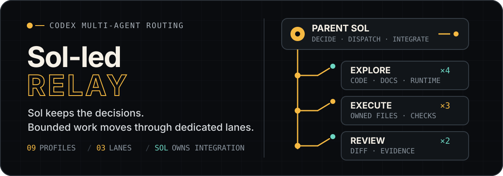
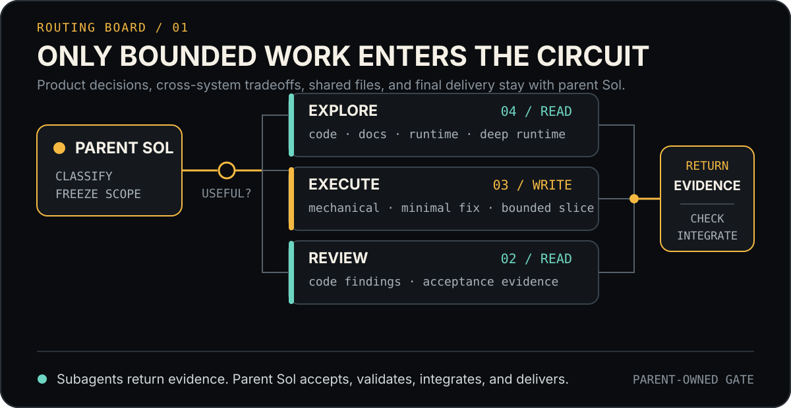

<p align="right">
  <a href="./README.md">简体中文</a> · <strong>English</strong>
</p>

<p align="center">
  
</p>

<p align="center">
  <strong>Keep Sol in control. Let complex work move through clearly bounded circuits.</strong><br>
  A narrow-role multi-agent routing package for project-level Codex work: explore on demand, execute within frozen scope, review independently, and leave integration and delivery to the parent task.
</p>

## What it solves

Complex work benefits from delegation, but delegation should not dilute ownership. Sol-led Relay assigns isolatable work to 9 specialized profiles while keeping requirement clarification, architecture decisions, shared-file coordination, final verification, and external delivery with parent Sol.

- **Delegate for real benefit**: start a subagent only when context isolation, parallel investigation, or independent review justifies the coordination cost; complete small and obvious tasks directly.
- **Route by boundary**: Explorers gather evidence, Executors write only inside frozen scope, and Reviewers inspect an actual diff or acceptance evidence.
- **Handoff by contract**: every dispatch must define the outcome, sources, scope, checks, stop condition, and return contract.
- **Fail closed**: a timeout is only a polling observation; no file change does not mean no progress; silence, insufficient evidence, or a failed check never grants automatic escalation, retry, or takeover.

## Routing board

<p align="center">
  
</p>

| Lane | Use it for | Profiles | Default permission |
| --- | --- | --- | --- |
| **Explore ×4** | Code paths, external documentation, one bounded runtime question, or an initially cross-system or contradictory investigation | `code_explorer` · `docs_researcher` · `runtime_investigator` · `runtime_investigator_deep` | read-only |
| **Execute ×3** | Exact mechanical edits, a minimal fix for a confirmed root cause, or a feature slice with frozen interfaces and acceptance criteria | `mechanical_executor` · `minimal_fixer` · `bounded_executor` | workspace-write |
| **Review ×2** | Correctness and regression review of a real implementation, or criterion-by-criterion acceptance-evidence review | `code_reviewer` · `verification_reviewer` | read-only |

Every profile uses `model_reasoning_effort = "max"`. `runtime_investigator_deep`, `code_reviewer`, and `verification_reviewer` use `gpt-5.6-terra`; all other profiles use `gpt-5.6-luna`.

> `runtime_investigator_deep` accepts only an investigation that is already cross-system or materially contradictory at dispatch time. It is not an automatic escalation path after an ordinary investigation returns inconclusive.

## One complete relay

1. **Parent Sol decides whether delegation is useful**: unresolved product, architecture, security, permission, and cross-system decisions stay with the parent.
2. **Select the smallest role set**: run at most three independent read-only agents in parallel; allow only one writer at a time and assign explicit file ownership.
3. **Send a bounded packet**: freeze the outcome, sources, scope, checks, stop conditions, and result format; children may not spawn descendants.
4. **Receive evidence, not decision authority**: parent Sol inspects the actual files, diff, artifacts, and validation output before accepting a result.
5. **Close the loop in the parent task**: integration, Git operations, builds, publishing, external writes, and the final response remain parent-owned.

## Install into a project

The standard installation surface has only two locations:

```text
<target-project>/
├── .codex/agents/*.toml
└── .agents/skills/sol-led-relay/**
```

This PowerShell example stops when it finds an existing Agent or Skill with the same name. It does not overwrite files of unknown origin:

```powershell
$relaySource = "D:\path\to\codex-relay\relay\sol-led-relay"
$targetProject = "D:\path\to\target-project"
$agentTarget = Join-Path $targetProject ".codex\agents"
$skillTarget = Join-Path $targetProject ".agents\skills\sol-led-relay"

$profileNames = Get-ChildItem (Join-Path $relaySource "agents\*.toml") | Select-Object -ExpandProperty Name
$conflicts = $profileNames | Where-Object { Test-Path (Join-Path $agentTarget $_) }
if ($conflicts -or (Test-Path $skillTarget)) {
    throw "Found an existing Agent or Skill with the same name; verify its source first: $($conflicts -join ', ')"
}

New-Item -ItemType Directory -Force $agentTarget, $skillTarget | Out-Null
Copy-Item (Join-Path $relaySource "agents\*.toml") $agentTarget
Copy-Item (Join-Path $relaySource "skills\sol-led-relay\*") $skillTarget -Recurse
```

If the target project already has a Skill installer or Junction convention, connect `skills/sol-led-relay` as the single source directory. Do not create or overwrite another copy whose provenance is unclear.

## Verification

Run the static validator from the `sol-led-relay` package root:

```powershell
python -X utf8 skills\sol-led-relay\scripts\validate_sol_led_relay.py
```

The validator checks the 9 profiles, exact models, `max` reasoning effort, sandbox defaults, implicit Skill routing, dispatch contracts, and fail-closed liveness, timeout, and interruption rules.

Valid configuration files do not prove that runtime discovery or isolation is effective. After installation, open a **new Codex task** and verify each discovered Agent name, model, reasoning effort, effective sandbox and approval policy, and visible tools. When permission isolation is an acceptance requirement, run mutation probes only against a disposable fixture inside the target project. If a read-only role can mutate it, record the result as `NOT_ENFORCED`.

## Package layout

```text
sol-led-relay/
├── agents/                         # Install into target .codex/agents/
│   ├── code_explorer.toml
│   ├── docs_researcher.toml
│   ├── runtime_investigator*.toml
│   ├── *_executor.toml
│   └── *_reviewer.toml
├── skills/sol-led-relay/           # Install into target .agents/skills/
│   ├── SKILL.md                    # Activation, routing, concurrency, failure boundaries
│   ├── agents/openai.yaml          # Display metadata and implicit invocation policy
│   ├── references/                 # Dispatch, routing, and evaluation contracts
│   └── scripts/                    # Static validator
├── README.en.md
└── README.md
```

There is no `default.toml`: the package does not let one broad default role absorb every task. `agents/` and the Skill are also distributed separately—the former declares runtime profiles; the latter decides when delegation is useful, how work is routed, and which authority must remain in the parent task.

## Design boundaries

| Subagents may | Parent Sol retains |
| --- | --- |
| Investigate within named sources and scope | Requirement, product, architecture, security, and permission decisions |
| Modify one explicitly owned file slice | Shared-file coordination and cross-slice integration |
| Run assigned deterministic checks | Authority to accept or reject subagent results |
| Return evidence, risk, and the smallest next step | Git, remote builds, publishing, external writes, and final delivery |

Read the complete behavior contract in [`skills/sol-led-relay/SKILL.md`](./skills/sol-led-relay/SKILL.md). The detailed contracts live in [`contracts.md`](./skills/sol-led-relay/references/contracts.md), [`routing.md`](./skills/sol-led-relay/references/routing.md), and [`evaluation.md`](./skills/sol-led-relay/references/evaluation.md).
