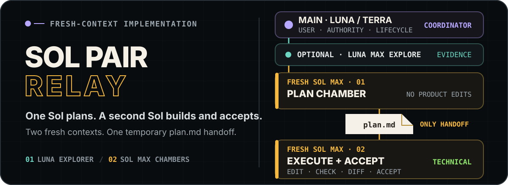
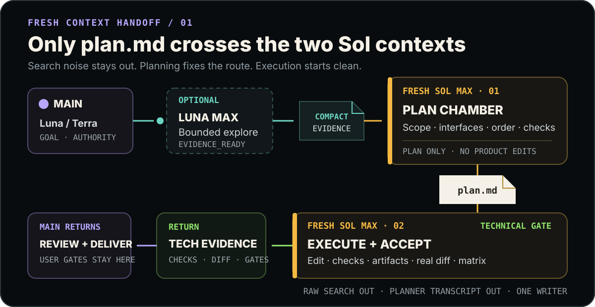

<p align="right">
  <a href="./README.md">简体中文</a> · <strong>English</strong>
</p>

<p align="center">
  
</p>

<p align="center">
  <strong>One Sol fixes the route. A second Sol builds it end to end with fresh context.</strong><br>
  Luna or Terra keeps the conversation, Luna Max compresses evidence, and two Sol Max agents hand off only a temporary <code>plan.md</code>.
</p>

<p align="center">
  <a href="#why-sol-pair-relay">Why</a> ·
  <a href="#relay-flow">Relay flow</a> ·
  <a href="#quick-start">Quick start</a> ·
  <a href="#boundaries-and-verification">Boundaries and verification</a>
</p>

## Why Sol Pair Relay

High-quality implementation usually requires investigation, decisions, planning, edits, and acceptance. If one Sol reads everything from raw logs through the final diff, early context crowds out the implementation and verification work that matters most. If implementation is delegated without an explicit plan, file boundaries, interfaces, and acceptance criteria can drift.

`sol-pair-relay` separates those costs:

- **the parent conversation stays stable:** a Luna Max or Terra Max Coordinator retains user intent, permissions, lifecycle, and delivery language;
- **exploration is compressed first:** optional `tm_explorer` answers one bounded evidence question without designing or mutating;
- **the first Sol only plans:** fresh-context `tm_planner` writes the goal, scope, interfaces, sequence, checks, and stop conditions into a temporary `plan.md`;
- **the second Sol only implements and accepts:** a different fresh-context `tm_executor` owns the approved writable surface, runs the checks, inspects the real diff, and evaluates technical acceptance;
- **the handoff is not a transcript:** the two Sol agents share only `plan.md` and a small amount of decision-critical evidence.

The package contains no Reviewer, Integrator, or `default.toml`. An Executor's `EXECUTION_PASS` is technical evidence; it never closes user, device, browser, visual, release, or external-system acceptance automatically.

## Relay flow

<p align="center">
  
</p>

| Phase | Agent | Model | Sole responsibility | Output |
| --- | --- | --- | --- | --- |
| Parent conversation | Coordinator (not a profile) | Recommended Luna Max / Terra Max | User communication, permissions, routing, final delivery | Phase packets and final report |
| Optional exploration | `tm_explorer` | Luna Max | One bounded read-only evidence question | `EVIDENCE_READY` |
| Temporary planning | `tm_planner` | Sol Max | Freeze one executable plan | `PLAN_READY` + `plan.md` |
| Implementation acceptance | `tm_executor` | A different Sol Max | Modify, check, diff-review, and technically accept the plan | `EXECUTION_PASS` or `BLOCKED` |

### One complete relay

1. The Coordinator decides whether the task merits the relay. Small, obvious, one-step changes stay direct.
2. If investigation would create substantial context noise, up to 3 independent read-only `tm_explorer` instances may run in parallel; the Coordinator compresses their results into decision evidence.
3. The Coordinator creates `.codex-team/runtime/<task-id>/` and sends a self-contained planning packet to a fresh `tm_planner`.
4. The Planner writes only `plan.md`; the Coordinator checks it against the original request and repository rules.
5. With `fork_turns = "none"`, the Coordinator dispatches a different `tm_executor` with only the approved plan, fixed decisions, and minimum critical evidence.
6. The Executor follows the dependency order, runs every check, inspects the actual diff and artifacts, and evaluates each acceptance row.
7. The Coordinator rechecks the real output, preserves unrun user or external gates, performs separately authorized delivery actions, and removes only this task's temporary directory after genuine completion.

Planner and Executor never run concurrently and can never be the same child. A concrete plan defect may be revised once before implementation begins; after mutation starts, the plan is not silently rewritten to route around a blocker.

## How the temporary plan prevents drift

[`execution-plan.md`](./skills/sol-pair-relay/references/execution-plan.md) requires:

- fixed user and repository decisions;
- exact writable scope, read sources, and protected paths;
- interfaces, data formats, and preserved behavioral invariants;
- each step's dependencies, implementation constraints, checks, risk, and stop conditions;
- an evidence matrix separating technical acceptance from user or external acceptance;
- final checks for the integrated result and gates that remain with the Coordinator.

This file is a temporary control surface for one task, not a long-lived specification. It must never be staged or committed. Remove it on completion and preserve it when blocked or interrupted so the same task can resume.

## Quick start

Requirements: Windows PowerShell and an available Python 3.11 or newer installation.

From the `sol-pair-relay` directory, verify the source package before installing it:

```powershell
.\scripts\verify.ps1
.\scripts\install.ps1
```

The default installation targets the current Windows user:

```text
%USERPROFILE%\.agents\skills\sol-pair-relay\
%USERPROFILE%\.codex\agents\tm_explorer.toml
%USERPROFILE%\.codex\agents\tm_planner.toml
%USERPROFILE%\.codex\agents\tm_executor.toml
```

> **Mutually exclusive with Poor Relay:** both packages intentionally use the same `tm_explorer`, `tm_planner`, and `tm_executor` names. The installer stops before writing when any same-named target exists and offers no silent overwrite. Uninstall the active package before switching.

After installation, start a new Codex task and inspect the Agents actually discovered, including model, reasoning effort, sandbox, and tools. You can invoke the Skill explicitly:

```text
Use $sol-pair-relay to implement this task through a temporary plan and a fresh Sol executor.
```

The Skill also permits implicit invocation, but its activation gate keeps small tasks in the parent conversation.

## What's included

```text
sol-pair-relay/
├── agents/                              # 3 explicit profiles
│   ├── tm_explorer.toml                # Luna Max, read-only exploration
│   ├── tm_planner.toml                 # Sol Max, temporary-plan-only
│   └── tm_executor.toml                # Sol Max, execution and technical acceptance
├── skills/sol-pair-relay/
│   ├── SKILL.md                         # Activation, relay, context, and authority boundaries
│   ├── agents/openai.yaml               # Codex UI metadata and implicit invocation
│   ├── references/execution-plan.md     # Temporary plan template
│   └── scripts/validate_sol_pair_relay.py
├── scripts/                             # Install, uninstall, and verification
├── assets/readme/                       # Bilingual editable pure SVG
├── README.en.md
├── THIRD_PARTY_NOTICES.md
└── LICENSE
```

## Boundaries and verification

- **Context isolation is structural:** the two Sol phases must use different Agents; raw exploration and Planner conversation do not enter the Executor context.
- **A plan grants no new authority:** user instructions and repository governance always win; conflict stops the relay instead of silently repairing the contract.
- **There is one writer:** the complete approved plan goes to one Executor, never competing writers.
- **Acceptance follows evidence classes:** static checks, builds, runtime interaction, devices, visuals, and user acceptance do not substitute for each other.
- **Failure does not expand scope:** repeated check failure, an unowned file, interface conflict, or missing permission returns `BLOCKED` without automatically adding a Reviewer or Integrator.
- **Static validation is not runtime proof:** successful TOML and script parsing does not prove that a fresh task discovered the profiles or that the declared sandbox is enforced.

Verify the source package:

```powershell
.\scripts\verify.ps1
```

Verify an installed copy:

```powershell
.\scripts\verify.ps1 -Installed
```

The validator checks exactly 3 profiles, models, `max` reasoning effort, sandbox defaults, two-Sol separation, plan handoff, technical acceptance, PowerShell syntax, README assets, and absence of `default.toml`. If read-only enforcement is an acceptance requirement, use only a disposable fixture inside the target project for a real write-rejection probe.

## Uninstall

```powershell
.\scripts\uninstall.ps1
```

The uninstaller removes only the three profiles marked as Sol Pair Relay and this package's Skill. It refuses to remove a same-named profile from another source and preserves the parent `.agents` and `.codex` directories.

## Provenance and license

This package uses Poor Relay as its local structural reference and narrows the workflow to “Luna explores, two fresh Sol agents relay planning into implementation.” See [THIRD_PARTY_NOTICES.md](THIRD_PARTY_NOTICES.md) for sources, copyrights, and adaptation boundaries.

The project is licensed under the [MIT License](LICENSE).
