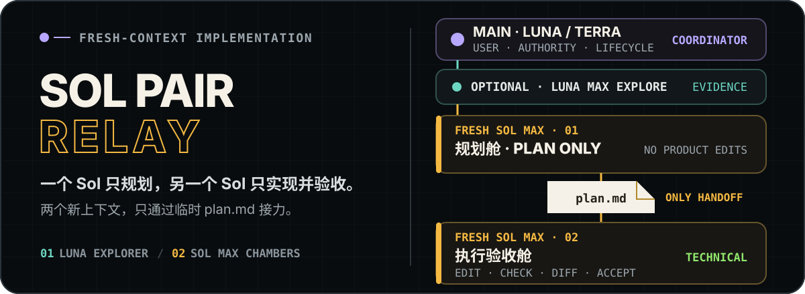
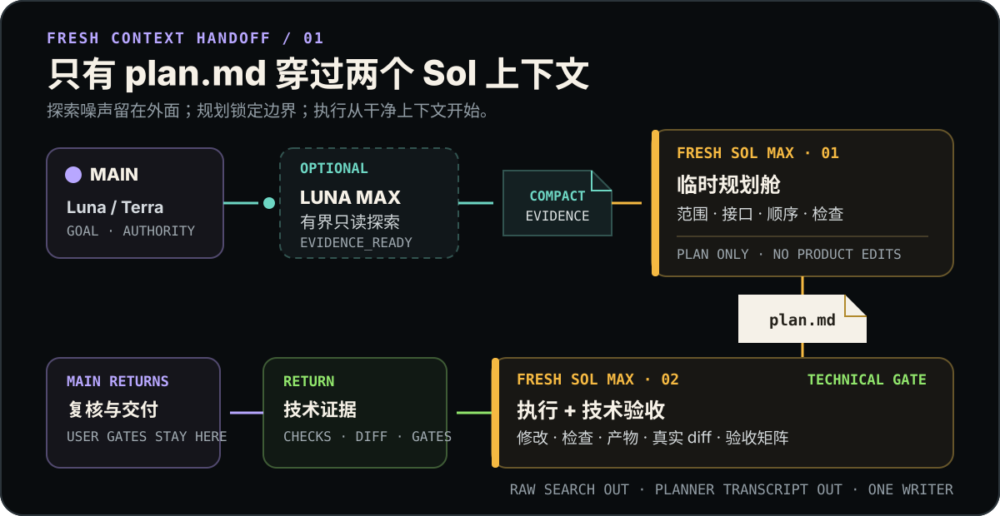

<p align="right">
  <strong>简体中文</strong> · <a href="./README.en.md">English</a>
</p>

<p align="center">
  
</p>

<p align="center">
  <strong>一个 Sol 只负责把路标钉牢，另一个 Sol 带着新上下文实现到底。</strong><br>
  Luna / Terra 保持主对话；Luna Max 压缩证据；两个 Sol Max 只通过临时 <code>plan.md</code> 接力。
</p>

<p align="center">
  <a href="#为什么需要-sol-pair-relay">为什么</a> ·
  <a href="#接力图">接力图</a> ·
  <a href="#快速开始">快速开始</a> ·
  <a href="#边界与验证">边界与验证</a>
</p>

## 为什么需要 Sol Pair Relay

高质量实现通常要经历调查、决策、规划、修改和验收。如果同一个 Sol 从原始日志一路读到最终 diff，前半段的上下文会挤占真正实现和复核所需的空间；如果直接把实现交给没有计划的 Agent，又容易在文件边界、接口和验收口径上偏航。

`sol-pair-relay` 把这两个问题拆开：

- **主对话保持稳定**：Luna Max 或 Terra Max Coordinator 保留用户意图、权限、生命周期与交付语言；
- **探索先压缩**：可选的 `tm_explorer` 只回答一个有界证据问题，不做设计和修改；
- **第一个 Sol 只规划**：`tm_planner` 在新上下文中把目标、范围、接口、顺序、检查与停止条件写进临时 `plan.md`；
- **第二个 Sol 只实现并验收**：另一个全新的 `tm_executor` 读取已批准计划，完成整个可写范围，运行检查、审阅真实 diff，并逐项做技术验收；
- **转交物不是聊天记录**：两个 Sol 不共享长对话，只共享 `plan.md` 和少量决策关键证据。

本包没有 Reviewer、Integrator 或 `default.toml`。Executor 的 `EXECUTION_PASS` 是技术证据，不会自动关闭用户、设备、浏览器、视觉、发布或外部系统验收。

## 接力图

<p align="center">
  
</p>

| 阶段 | Agent | 模型 | 唯一职责 | 输出 |
| --- | --- | --- | --- | --- |
| 主对话 | Coordinator（不是 profile） | 推荐 Luna Max / Terra Max | 用户沟通、权限、路由、最终交付 | 任务包与最终说明 |
| 可选探索 | `tm_explorer` | Luna Max | 一个有界只读证据问题 | `EVIDENCE_READY` |
| 临时规划 | `tm_planner` | Sol Max | 冻结一个 Executor 可执行的计划 | `PLAN_READY` + `plan.md` |
| 实现验收 | `tm_executor` | 另一个 Sol Max | 按计划修改、检查、审 diff、技术验收 | `EXECUTION_PASS` 或 `BLOCKED` |

### 一次完整接力

1. Coordinator 判断任务是否值得启动接力；小而明确的一步修改直接完成。
2. 如果调查会制造大量上下文，最多并行派发 3 个互不依赖的只读 `tm_explorer`，然后把结果压缩成决策证据。
3. Coordinator 创建 `.codex-team/runtime/<task-id>/`，把自包含规划包交给一个全新的 `tm_planner`。
4. Planner 只写 `plan.md`；Coordinator 对照原始请求和仓库规则批准或阻止它。
5. Coordinator 用 `fork_turns = "none"` 派发另一个 `tm_executor`，只提供已批准计划、固定决策和最小关键证据。
6. Executor 按依赖顺序完成计划，运行全部检查，审阅实际 diff 和产物，并逐项填写验收结果。
7. Coordinator 复核真实输出，保留未运行的用户或外部门槛，完成已授权的交付步骤；整体完成后只清理当前任务的临时目录。

Planner 与 Executor 绝不并行，也不能由同一个子 Agent 兼任。计划发现实质契约缺陷时，最多在实现开始前修订一次；实现开始后不允许为了绕过 blocker 静默改计划。

## 临时计划如何防偏

[`execution-plan.md`](./skills/sol-pair-relay/references/execution-plan.md) 强制记录：

- 固定的用户与仓库决策；
- 精确可写范围、可读来源和受保护路径；
- 接口、数据格式与必须保持的行为不变量；
- 每一步的依赖、实现约束、检查、风险与停止条件；
- 技术验收与用户 / 外部验收分开的证据矩阵；
- 完整结果必须通过的最终检查和仍需 Coordinator 处理的门槛。

这个文件是一次任务的临时控制面，不是长期规格。它不得 stage 或 commit；任务完成后删除，阻塞或中断时保留以便原任务恢复。

## 快速开始

要求：Windows PowerShell，以及可用的 Python 3.11 或更高版本。

在 `sol-pair-relay` 目录先验证源码包，再安装：

```powershell
.\scripts\verify.ps1
.\scripts\install.ps1
```

默认安装到当前 Windows 用户：

```text
%USERPROFILE%\.agents\skills\sol-pair-relay\
%USERPROFILE%\.codex\agents\tm_explorer.toml
%USERPROFILE%\.codex\agents\tm_planner.toml
%USERPROFILE%\.codex\agents\tm_executor.toml
```

> **与 Poor Relay 互斥安装：** 两套包刻意使用相同的 `tm_explorer`、`tm_planner` 和 `tm_executor` 名称。安装器发现任一同名目标就会在写入前停止，也不提供静默覆盖选项。切换前请先运行当前包的卸载脚本。

安装后启动一个新的 Codex task，检查实际发现的 Agent 名称、模型、reasoning effort、sandbox 与工具。可以显式调用：

```text
Use $sol-pair-relay to implement this task through a temporary plan and a fresh Sol executor.
```

Skill 允许隐式触发，但小任务仍会先被 activation gate 留在主会话直接处理。

## 包含内容

```text
sol-pair-relay/
├── agents/                              # 3 个显式 profile
│   ├── tm_explorer.toml                # Luna Max，只读探索
│   ├── tm_planner.toml                 # Sol Max，只写临时计划
│   └── tm_executor.toml                # Sol Max，执行与技术验收
├── skills/sol-pair-relay/
│   ├── SKILL.md                         # 激活、接力、上下文与权限边界
│   ├── agents/openai.yaml               # Codex UI 元数据与隐式触发
│   ├── references/execution-plan.md     # 临时计划模板
│   └── scripts/validate_sol_pair_relay.py
├── scripts/                             # 安装、卸载与验证
├── assets/readme/                       # 双语可编辑纯 SVG
├── README.en.md
├── THIRD_PARTY_NOTICES.md
└── LICENSE
```

## 边界与验证

- **上下文隔离是结构性要求**：两个 Sol 必须是不同 Agent；原始探索输出和 Planner 对话不进入 Executor。
- **Plan 不是新权限**：用户指令和仓库治理始终优先；冲突时停止，不自动修补契约。
- **一个写入所有者**：整份已批准计划只交给一个 Executor，不拆成竞争写入者。
- **验收按证据分类**：静态检查、构建、运行交互、设备、视觉与用户接受互不替代。
- **失败不扩权**：重复检查失败、未拥有文件、接口冲突或缺少权限都会返回 `BLOCKED`，不会自动追加 Reviewer 或 Integrator。
- **静态验证不是运行时证明**：TOML 和脚本解析成功，不能证明新 task 已发现 profile，也不能证明声明的 sandbox 已实际强制执行。

验证源码包：

```powershell
.\scripts\verify.ps1
```

验证已安装副本：

```powershell
.\scripts\verify.ps1 -Installed
```

验证器会检查精确的 3 个 profile、模型、`max` 推理强度、sandbox 默认值、双 Sol 分离、计划转交、技术验收、PowerShell 语法、README 资源与 `default.toml` 缺失。需要证明只读隔离时，只在目标项目的可丢弃 fixture 上做真实写入拒绝测试。

## 卸载

```powershell
.\scripts\uninstall.ps1
```

卸载器只删除带有 Sol Pair Relay 标记的三个 profile 和本包 Skill；同名文件来源不匹配时会拒绝删除，并保留父级 `.agents` 与 `.codex` 目录。

## 来源与许可证

本包以仓库内的 Poor Relay 为结构参考，并重新收窄为“Luna 探索 + 两个新鲜 Sol 接力”。来源、版权与改编边界见 [THIRD_PARTY_NOTICES.md](THIRD_PARTY_NOTICES.md)。

项目采用 [MIT License](LICENSE)。
